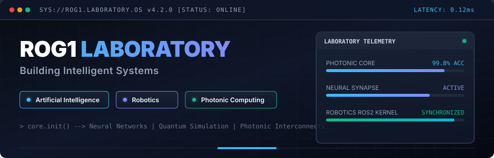

  

# Mission

My mission is to engineer systems that amplify human capability.

I work across Artificial Intelligence, Robotics, Photonic Computing and Business Intelligence Systems.

Every project contributes to technologies that continue serving people beyond their creators.

---

# Dashboard

<!--START_SECTION:dashboard-->
| Metric | Value |
| --- | --- |
| Status | 🟢 Online |
| Repositories | 7 |
| Research Notes | 531 |
| Projects | 13 |
| Languages |  Rust  Python  C  TypeScript  🔥 Mojo |
| Current Focus | Artificial Intelligence Robotics Photonic Quantum Computing |
| Last Update | 2026-08-06 |
<!--END_SECTION:dashboard-->

---

# Research

<!--START_SECTION:research-->
### Latest Notes

• Quantum Error Correction
• Integrated Photonics
• Reinforcement Learning

### Research Progress

| Category | Progress |
|---|---|
| **AI + CS** | `██████████░░░░` |
| **Photonic CS** | `███████░░░░░░░` |
| **BTM** | `█████░░░░░░░░░` |
| **Robotics** | `█████████░░░░░` |
<!--END_SECTION:research-->

---

# Engineering

<!--START_SECTION:engineering-->
| System | Description |
| --- | --- |
| ForgeAI | AI engineering and intelligent software framework |
| PAC+ | High-performance intelligent system under active development |
| Cliro | Automated developer and robotics tooling CLI |
| AdMais | Creative technologies powered by deep learning |
| Path to Photonic | Open research vault & photonic computing laboratory |
| Sentinel.ai | Autonomous monitoring and decision system |
<!--END_SECTION:engineering-->

---

# Projects

<!--START_SECTION:projects-->
| Repository | Language | Updated | Stars | Description |
| --- | --- | --- | --- | --- |
| [rogerio-jose-gastao](https://github.com/rogerio-jose-gastao/rogerio-jose-gastao) | Python | 2026-08-06 | ⭐ 1 | My descriptions |
| [manual-leptos](https://github.com/rogerio-jose-gastao/manual-leptos) | Rust | 2026-08-04 | ⭐ 0 | No description provided. |
| [path_to_photonic](https://github.com/rogerio-jose-gastao/path_to_photonic) | Markdown | 2026-07-23 | ⭐ 0 | No description provided. |
| [to-do_list](https://github.com/rogerio-jose-gastao/to-do_list) | TypeScript | 2024-07-27 | ⭐ 0 | A to-do list app build with React and Typescript. |
| [lowlighter](https://github.com/rogerio-jose-gastao/lowlighter) | Markdown | 2024-01-26 | ⭐ 1 | 🦑 A GitHub profile auto-generated with metrics, starred topics, an isometric contribution calendar, suggested music tracks, website performances, most used languages, etc. ! |
| [links-uteis](https://github.com/rogerio-jose-gastao/links-uteis) | Markdown | 2024-01-21 | ⭐ 1 | 📎 Lista de links úteis para o desenvolvimento de projetos de programação e design |
| [calculator-app-main](https://github.com/rogerio-jose-gastao/calculator-app-main) | CSS | 2024-01-21 | ⭐ 1 | My second calculetor, only a funny way of codding day |
<!--END_SECTION:projects-->

---

# Learning

<!--START_SECTION:learning-->
- **Systems & High Performance**: `Rust` • `Leptos` • `Tokio` • `CUDA`
- **Robotics & Simulation**: `ROS2` • `Control Theory` • `Photonic Simulation`
- **Strategy & Architecture**: `Business Strategy` • `Deep Tech Systems`
<!--END_SECTION:learning-->

---

# Followers

<!--START_SECTION:followers-->
                       
<!--END_SECTION:followers-->

---

# Footer

> *"Build things that continue serving after you're gone."*
>
> — **Rogério Gastão**
